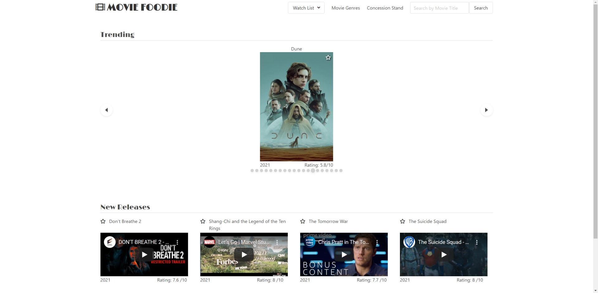
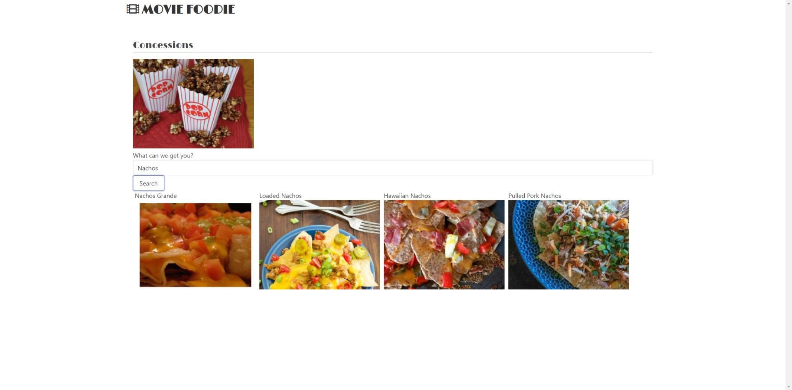

# MovieFoodie
- Users are greeted with a home screen that shows a carousel of trending movies, and new release trailers.
- Users can search for a specific title using the Nav bar search function or by genre by clicking the genre in the nav bar and picking their desired genre.
- When the user clicks on the star, the movie is added to their watch list, and if they click the star again it is removed.

## Deployed Application and Repository
- [Repository](https://github.com/michellewehr/MovieFoodie)
- [Deployed aplication](https://michellewehr.github.io/MovieFoodie/)

## Screenshots

